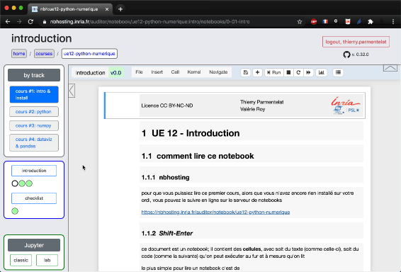
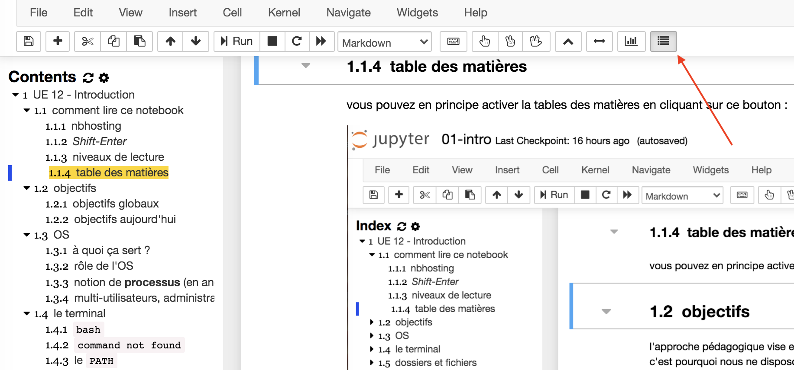

---
jupytext:
  cell_metadata_filter: all,-hidden,-heading_collapsed,-run_control,-trusted
  encoding: '# -*- coding: utf-8 -*-'
  notebook_metadata_filter: all, -jupytext.text_representation.jupytext_version, -jupytext.text_representation.format_version,
    -language_info.version, -language_info.codemirror_mode.version, -language_info.codemirror_mode,
    -language_info.file_extension, -language_info.mimetype, -toc
  text_representation:
    extension: .md
    format_name: myst
kernelspec:
  display_name: Calysto Bash
  language: bash
  name: calysto_bash
language_info:
  help_links:
  - text: MetaKernel Magics
    url: https://metakernel.readthedocs.io/en/latest/source/README.html
  name: bash
nbhosting:
  title: notebooks
---

```{code-cell}
%%python
from IPython.display import HTML
HTML(url="https://raw.githubusercontent.com/ue12-p22/intro/main/notebooks/media/style.css")
```

<div class="license">
    <span>Licence CC BY-NC-ND</span>
    <div class="column center">
        <span>Thierry Parmentelat</span>
        <span>Valérie Roy</span>
    </div>
    <div class="column">
        
        
    </div>
</div>

+++

# notebooks

+++

## comment lire ce notebook

+++

### nbhosting

+++

pour que vous puissiez lire ce premier cours, alors que vous n'avez encore rien installé sur votre ordi, rendez-vous en ligne sur le serveur de notebooks

<https://nbhosting.inria.fr/auditor/notebook/ue12-p21-python-primer>

+++



+++

### *Shift-Enter*

+++

ce document est un *notebook*; il contient des **cellules**, avec soit du texte (comme
celle-ci), soit du code (comme la suivante) qu'on peut exécuter au fur et à mesure qu'on
lit

le plus simple pour lire un notebook c'est de

* sélectionner une cellule (avec la souris)
* taper *Maj-Entrée* (ou *Shift-Return* sur un clavier anglais)  
  ça exécute la cellule courante et ça passe à la suivante; essayez...

```{code-cell}
# ma première cellule de code contient
# un commentaire
# et une commande toute simple
# qui affiche un message

echo "hey there"
```

vous avez dû provoquer l'affichage de `hey there` comme résultat de l'exécution de la cellule juste au dessus de celle-ci;  
continuez la lecture en faisant 'Maj-Entrée'

+++

remarquez que dans ce notebook le code qui s'exécute n'est pas du Python, c'est du bash - le langage du terminal

+++

### table des matières

+++

vous pouvez en principe activer la tables des matières en cliquant sur ce bouton :  
(sinon, voyez la toute dernière section)



+++ {"slideshow": {"slide_type": ""}}

## objectifs

+++

l'approche pédagogique vise en premier lieu **à vous mener à l'autonomie** en ce qui
concerne l'utilisation des ressources digitales; c'est pourquoi nous ne sommes **pas en
salle informatique** comme ça a pu se faire à une époque; l'objectif est que vous sachiez
à terme utiliser **uniquement votre ordinateur** pour travailler (ce qui a été très
pratique lors des confinements liés au covid).

+++

ce cours d'introduction vise à présenter, et à vous faire installer, les outils de base
pour le cours d'informatique; il ne présente **aucune difficulté** mais vous êtes invité·e
malgré tout à le suivre **avec une grande attention** car tous ces éléments sont
**cruciaux pour la suite**

+++ {"slideshow": {"slide_type": ""}}

### objectifs globaux

pour le cours d'informatique de 1ère année :

* prise d'**autonomie**  
  * par rapport à un ordinateur personnel
  * par rapport au numérique et à la programmation
  * focus sur quelques outils (du moment)
* pour les mathématiques, le machine-learning et autres enseignements
  * Python - numpy - pandas - matplotlib  
  * notebooks Jupyter
* workflow de gestion de projets de développement
  * git & github
* approfondissement langage (un parmi 3)
  * Python
  * C++
  * Java
* culture informatique
  * notions d'algorithmique et de complexité
  * notions sur les systèmes d'exploitation des ordinateurs (OS)   
  * rudiments de programmation Web
  * rudiments sur programmation parallèle
  * rudiments sur l'utilisation du réseau
* projet informatique
  * en équipe
  * posé par une personne extérieure à l'équipe d'enseignants

+++

### objectifs

pour ce premier cours d'introduction/installation

* survol ultra-rapide des concepts de base (simple, basique)
* survol rapide et installation des outils de base  
  * OS, terminal, dossiers et fichiers
  * éditeur de code, markdown
  * git (ultra-light)
  * Python, Jupyter
* être capable de rapatrier le cours sur votre ordi, et d'y exécuter les notebooks

Notez que

* le cours est **coopératif**, et pas compétitif  
  ceux qui savent déjà **aident leurs camarades**

* voyez aussi la checklist des compétences requises - [notebook
  `2-98-checklist.md`](https://nbhosting.inria.fr/auditor/notebook/ue12-p21-python-primer/notebooks/2-98-checklist)

  * à terminer pour la prochaine fois si nécessaire

+++

### niveaux de lecture

+++

on a défini plusieurs niveaux de lecture, parfois représentées avec des couleurs

+++ {"tags": ["level_basic"]}

#### basique

+++ {"tags": ["level_intermediate"]}

#### intermédiaire

+++ {"tags": ["level_advanced"]}

#### avancé

+++

pour que les couleurs apparaissent bien (lorsque vous lisez les notebooks en local sur votre ordi), vous devez avoir installé 

```bash
pip install nb-courselevels
```

+++ {"tags": ["framed_cell"]}

#### cadres

parfois aussi les cellules apparaissent avec un cadre comme celle-ci

et de la même façon pour que cela fonctionne il vous avoir installé `nb-courselevels`
